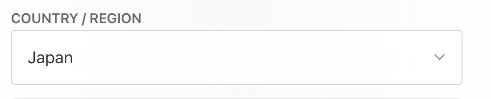

# BEYBLADE X App for iOS/Apple users

I'm too lazy to write a cringe introduction so let's get straight to the point.  

# Creating a (new) Apple ~~ID~~ Account account
### This is to access the Japanese App Store

There's many ways to make a new account but for the purposes of this guide, I'll use the desktop website.  
NOTE: You don't NEED a VPN for this (which is why iOS is superior)

1. Go to [https://appleid.apple.com/account] to make a new account and follow as normal.
    * Make sure to select your region to Japan!!!
    * You can still use a US phone number to sign up.
  
2. After doing a CAPTCHA and verifying email and phone number, your account should be made.
3. On your iOS device, go to Settings -> your account -> Media and Purchases -> sign out. This is so it only switches to your new account for App Store and not your entire phone/device.
    * Alternatively, go to App Store -> tap your account icon -> scroll down to Sign Out. Then log in to your new account from there.
4. Attempt to install a free app (or just go straight to looking up "BEYBLADE X" and downloading that.) This will prompt a message saying that your account "has not yet been used in the iTunes store." Tap Review.
5. Make sure your account is still Japan. Tap Next.
6. Fill in your info:
    * Payment Method: Keep it as "None."    
    * Phonetic Name: This field is for your name but pronounced in カナ. If you're Japanese-illiterate, use this [site](https://www.sljfaq.org/cgi/e2k.cgi)
       * (Or use any English to Katakana converter site)
    * Address: This part matters the least because you can just type in whatever bullshit and Apple will never check or send anything there lol. Still recommend nicking off a random McDonalds or Starbucks off Shibuya or something.
7. You should now be able to install Beyblade X app.
